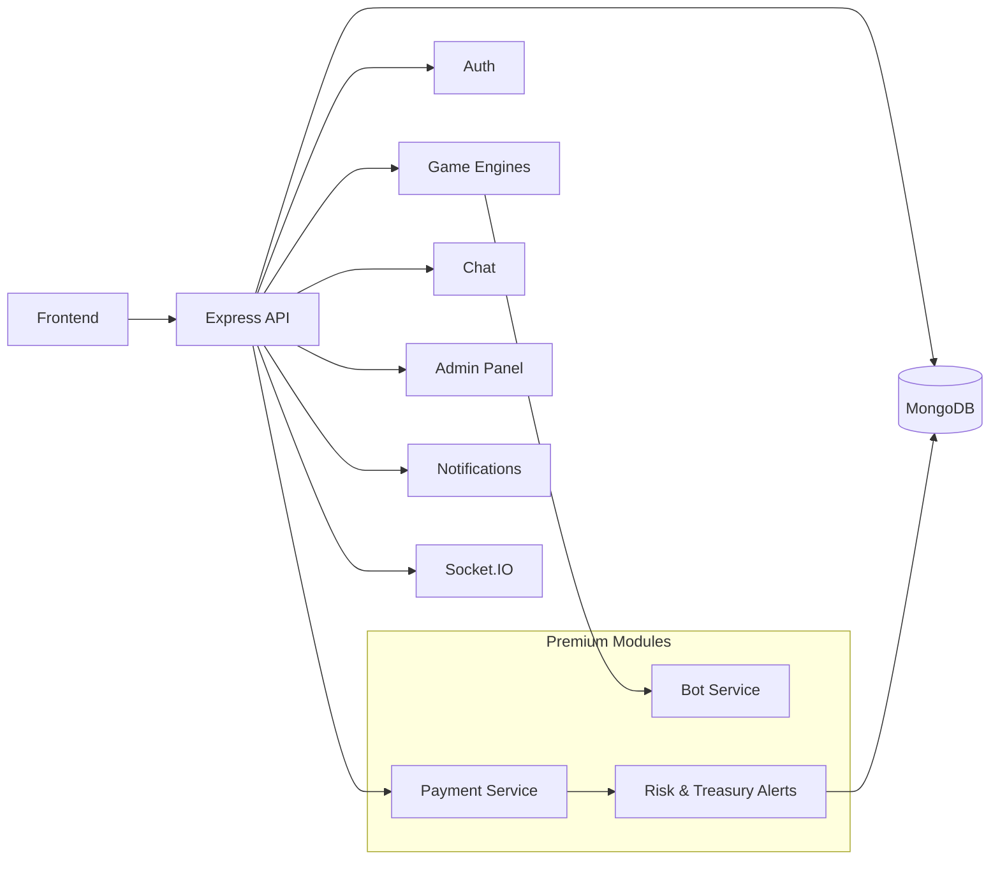

# Crypto GameFi MarketHub - Sport, Roulette, Jackpot, Coinflip, NFT, Trading ...

Welcome to Crypto Gaming Hub, a modern cryptocurrency gaming platform. This platform offers multiple provably fair games including Sports, Jackpot, and Roulette.
And this platform offers NFT Marketplace and Trading

*Main dashboard showing all available games*

## Overview

REST and real-time backend for a crypto-enabled betting platform. The design prioritizes low-latency gameplay, real-time collaboration, and operational controls, while remaining straightforward to run and extend locally.

This repository contains the **public core**: shared API, persistence, authentication, Socket.IO, and notifications. **Payment processing** and **bot service** modules are not included; they are distributed separately. The architecture diagram below illustrates the full system so integrations points are visible.

---

## Architecture

| Layer | Responsibility |
|--------|----------------|
| **API** | Express.js REST: authentication, users, games metadata, history, admin |
| **Real-time** | Socket.IO for live game state, chat, and dashboards |
| **Games** | Sport, Roulette, Jackpot, Coinflip, and related engines ship with the **private** backend. In this public build, game HTTP routes and game Socket.IO handlers are **disabled** |
| **Data** | MongoDB (users, balances, bets, history, notifications, configuration) |
| **Security** | JWT, wallet signatures, validation, rate limiting |
| **Notifications** | Email (EmailJS) and in-app notifications |

**Premium / private (not in this repo):** blockchain settlement, deposit and withdrawal flows, autonomous bot players, and extended risk or treasury automation.

### System diagram (full vision, including premium modules)



---

## Tech stack

- **Runtime:** Node.js  
- **HTTP:** Express.js  
- **Database:** MongoDB, Mongoose  
- **WebSocket:** Socket.IO  
- **Auth:** JWT, wallet signatures, optional Supabase  
- **Email:** EmailJS  
- **Hardening:** Helmet, CORS, rate limiting  

---

## Prerequisites

- Node.js 16 or later  

---

## Quick start

### 1. Install dependencies

```bash
npm install
cd client
npm install
cd ..
```

### 2. Start the server

```bash
npm start
```

---

## Environment variables

Treat `env.example` as a template only; never commit production secrets.

### Core

| Variable | Required | Description |
|----------|----------|-------------|
| `MONGODB_URI` | No | MongoDB connection string |
| `PORT` | No | HTTP port (default often `3000`) |
| `NODE_ENV` | No | `development` or `production` |
| `FRONTEND_URL` | No | Primary frontend origin (CORS) |
| `ADMIN_FRONTEND_URL` | No | Admin UI origin (CORS) |
| `ALLOWED_ORIGINS` | No | Additional comma-separated CORS origins |


## Premium modules (outside this repository)

The following are **not** part of the public codebase but are referenced in the diagram for integration planning:

- **Payments** — gateways, webhooks, deposit and withdrawal tracking, reconciliation, on-chain mapping; credentials such as `NOWPAYMENTS_*`, `CRYPTOPAY_*`, and RSA material belong only in private configuration.  
- **Bot service** — configurable automated players for load and game-specific strategies; isolated from the public demo build.  

Business-specific compliance, treasury policy, and provider choice remain in private deployments; this repository provides the auditable API and real-time core.

---

## Security: full / private builds

Do not publish the following in public repositories or shared sample environments:

- **Secrets:** `JWT_SECRET`, `ADMIN_BOOTSTRAP_TOKEN`, `TREASURY`, Supabase service role key, payment API keys, EmailJS private key, bot-related keys.  
- **Operational data:** production `MONGODB_URI`, production URLs, internal admin endpoints, webhook signing secrets.  

The public core does not require payment or bot secrets to run locally.

---

## Support

If you have any questions or would like a more customized app for specific use cases, please feel free to contact us at the contact information below.

---

**Happy Gaming! 🎰🎮💎**
